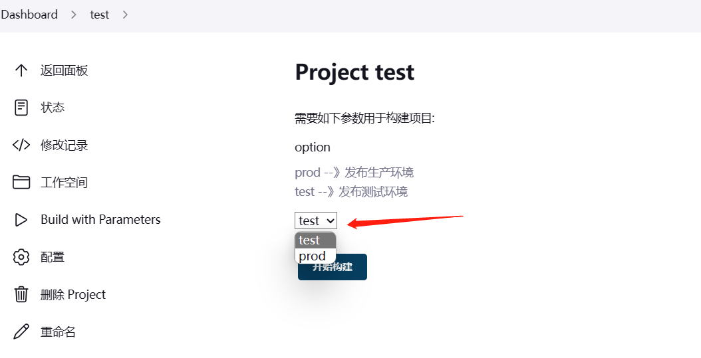
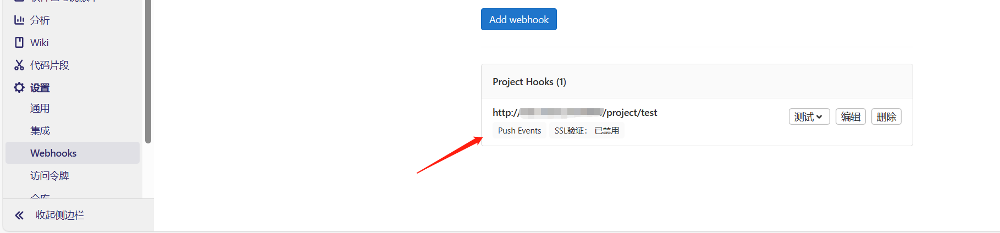

# jenkins

官网：[Jenkins](https://www.jenkins.io/zh/)

文档：[Jenkins 用户手册](https://www.jenkins.io/zh/doc/)

下载地址：[War Jenkins Packages](https://mirrors.jenkins.io/war-stable/)

国内镜像站：[Index of /jenkins/war-stable/ | 清华大学开源软件镜像站 | Tsinghua Open Source Mirror](https://mirror.tuna.tsinghua.edu.cn/jenkins/war-stable/)

pipeline:[流水线 (jenkins.io)](https://www.jenkins.io/zh/doc/book/pipeline/)

功能特点：

- 开源免费
- 多平台支持（windows/linux/macos）
- 提供web可视化配置管理页面
- 插件资源丰富

## jenkins安装

### war包部署

需要jdk环境

JDK-11 tar下载地址：[Java Archive Downloads - Java SE 11 | Oracle 中国](https://www.oracle.com/cn/java/technologies/javase/jdk11-archive-downloads.html)

```
# Java11环境变量配置
export JAVA_HOME=/devtools/java/java11/jdk-11.0.14
export CLASSPATH=$JAVA_HOME/lib
export PATH=$PATH:$JAVA_HOME/bin
 
 
# Java8环境变量配置
export JAVA_HOME=/devtools/java/java8/jdk1.8.0_321
export CLASSPATH=.:$JAVA_HOME/jre/lib/rt.jar:$JAVA_HOME/lib/dt.jar:$JAVA_HOME/lib/tools.jar
export PATH=$PATH:$JAVA_HOME/bin
```


```
yum -y install java-11-openjdk 
```

```
nohup java -jar -Xms1024m -Xmx4096m jenkins.war --httpPort=8080 &
```

默认的war包密码存储路径： /root/.jenkins/secrets/initialAdminPassword

默认的war包插件存储路径：/root/.jenkins/plugins/ #该路径可以打包，然后放到其他慢的jenkins下

rpm或deb或yum等安装 默认的Jenkins 插件和密码存储路径为： /var/lib/jenkins

可以在/etc/rc.d/rc.local 加入命令 开机自启

### jenkins 数据目录

```
caches: 系统缓存目录
jobs: jenkins项目作业
nodes: jenkins slave 节点信息
secrets: 密钥信息
userContent: 类似于web站点目录，可以上传一些文件
workspace: 默认的工作目录
fingerprints: 指纹验证信息
logs: 日志信息
plugins: 插件相关配置
updates: 插件更新目录
users: jenkins系统用户目录
```

### docker部署

```
docker pull jenkins
mkdir /opt/jenkins
chmod 777 /opt/jenkins
docker run -d -uroot -p 9095:8080 -p 50000:50000 --name jenkins -e JAVA_OPTS="-Dorg.apache.commons.jelly.tags.fmt.timeZone=Asia/Shanghai" -v/opt/jenkins:/var/jenkins_home -v /etc/localtime:/etc/localtime jenkins

docker logs jenkins #获取初始化密码
```

ubuntu 通过dpkg -i 安装时需提前安装依赖

```
apt-get -i daemon
```

配置国内插件镜像：http://mirror.xmission.com/jenkins/updates/update-center.json

重启页面: http://ip:8080/restart

## jenkins-slave

Manage jenkins-->Security

确保和savle通信的端口号开启而不是禁用（默认50000）


Dashboard--》Manage Jenkins--》Nodes


Number of executors： 配置构建最大并发数，配置为 cpu个数一样


保存好之后点击 刚刚创建的节点，进去之后按步骤即可


配置jenkins-agent.service 开机自启

```
vim /usr/lib/systemd/system/agent.service
[Unit]
After=network-online.target
Wants=network-online.target
[Service]
Type=exec
Environment=secret=5b98a27215ab5a0332fffe63d09e35379da2def3d11d4e30d1d91add342eb668
ExecStart=/opt/jdk-11.0.20/bin/java -jar /opt/jenkins/agent.jar -jnlpUrl http://192.168.0.106:8080/computer/build01/jenkins-agent.jnlp -secret ${secret>
[Install]
WantedBy=multi-user.target

systemctl daemon-reload
systemctl enable agent.service
```


## jenkins 自带的环境变量

```
BUILD_ID  //构建号
JOB_NAME  //项目名称
WORKSPACE  //工作目录
```


## jenkins 用户管理

安装Role-Based插件，安装后重启jenkins


重启后，选择 Manage Jenkins- -Configure Global Security--授权策略中选择。


**Global roles**
创建全局角色，例如管理员，普通用户等 从而可以在全局基础上设置总体，代理，作业，运行，查看和SCM权限。


**Item roles**
创建项目角色，仅允许基于项目设置Job和Run权限，分别用不同的项目权限对项目进行管理。

Pattern 字段 写该角色可以管理哪些 项目

- 如果将字段设置为java-.*，则该角色将匹配名称以开头的所有作业java-.
- 模式区分大小写。要执行不区分大小写的匹配，请使用(?i)表示法： (?i)vue_.*这样不区分大小写的。


创建好角色后点击 应用 ，然后去添加用户


创建好后  Manage Jenkins -- Manage and Assign Roles -- Assign Roles


分配到刚创建的user角色即可登录，项目也是如此，只需要将用户绑定到需要的角色就实现了用户管理


## jenkins 忘记密码处理

1、修改~/.jenkins/config.xml 文件

```
#删除一下代码，删除前备份
 <useSecurity>true</useSecurity>
  <authorizationStrategy class="hudson.security.FullControlOnceLoggedInAuthorizationStrategy">
    <denyAnonymousReadAccess>true</denyAnonymousReadAccess>
  </authorizationStrategy>
  <securityRealm class="hudson.security.HudsonPrivateSecurityRealm">
    <disableSignup>true</disableSignup>
    <enableCaptcha>false</enableCaptcha>
  </securityRealm>
```

删除之后重启jenkins服务

2、访问jenkins

Manage Jenkins》Security


保存后，进入设置


点击admin设置修改密码即可，修改后，把jenkins停止 把原先备份的config.xml 还原

## jenkins 配置gitlab

安装git

```
yum -y install git
```

配置git命令路径  系统管理-全局工具配置


jenkins服务中生成ssh-key

```
ssh-keygen   #生成密钥
```

gitlab中配置ssh公钥

EWY8U`5VLZI9G.jpg)

然后点ssh密钥，在jenkins服务器中把 cat ~/.ssh/id_rsa.pub 命令的执行结果粘贴


jenkins中配置私钥，系统管理-credemtoals(凭据)-全局-add（添加）


## jenkins配置maven

安装并配置maven

```
wget --no-check-certificate https://dlcdn.apache.org/maven/maven-3/3.8.8/binaries/apache-maven-3.8.8-bin.tar.gz
tar -zxvf  apache-maven-3.8.8-bin.tar.gz
```

根据阿里镜像站配置阿里镜像源[maven镜像_maven下载地址_maven安装教程-阿里巴巴开源镜像站 (aliyun.com)](https://developer.aliyun.com/mirror/maven)

jenkins安装 Maven Integration 插件 使其能创建 maven 任务。

Jenkins中配置maven


maven 项目配置

pom.xml #每个java项目都有，用来定义是各种信息，比如jar包还是war包。

clean package  -Dmaven.test.skip=true #不用加mvn，跳过测试配置


## jenkins配置kubernetes

安装 kubernetes 插件


点击 clouds 配置k8s


k8s 集群 配置分为两种情况 一个是 k8s集群内部部署了Jenkins 来连接 k8s 集群 另一个中是 jenkins 在其他服务器和集群中部署连接k8s

第一种情况（k8s集群内） 配置非常简单

只需要注意  命名空间 要写 你jenkins pod 所在命名空间和 jenkins svc 地址


第二种 情况（k8s集群外部）

jenkins要想连接并操作k8s集群，需要配置授权，请求k8s集群的kube apiserver的请求，可以和kubectl一样利用config文件用作请求的鉴权，默认在~/.kube/config下，也可以单独严格指定权限细节，生成一个jenkins专用的config文件。
在jenkins中能够识别的证书文件为PKCS#12 certificate，因此需要先将kubeconfig文件中的证书转换生成PKCS#12格式的pfx证书文件

在 k8s-master 操作，生成配置

```
wget https://github.com/mikefarah/yq/releases/download/v4.34.1/yq_linux_amd64.tar.gz
tar -zxvf yq_linux_amd64.tar.gz 
mv yq_linux_amd64 /usr/bin/yq
yq --version
yq (https://github.com/mikefarah/yq/) version v4.34.1
mkdir -p /opt/jenkins-crt/

yq e '.clusters[0].cluster.certificate-authority-data' /root/.kube/config | base64 -d > /opt/jenkins-crt/ca.crt
yq e '.users[0].user.client-certificate-data' /root/.kube/config | base64 -d > /opt/jenkins-crt/client.crt
yq e '.users[0].user.client-key-data' /root/.kube/config | base64 -d > /opt/jenkins-crt/client.key
cd /opt/jenkins-crt/

需要输入两次密码，请保存好你的密码
openssl pkcs12 -export -out cert.pfx -inkey client.key -in client.crt -certfile ca.crt

ls
ca.crt  cert.pfx  client.crt  client.key
```

向jenkins中导入新生成的证书

系统管理——>Credentials——>添加全局凭据，选择certificate类型

--上传证书--输入密码--点击create（创建）即可


点击 clouds 配置k8s

1、k8s 地址 是 ~/.kube/config 的`server:`的值

2、k8s 服务证书key 是 /opt/jenkins-crt/ca.crt（刚刚生成的证书） 的内容

3、凭据选择 刚刚创建的

4、配置Jenkins地址和通道


### 报错处理

原因 为开启代理 tcp连接处理


配置代理连接处理

Manage Jenkins -- Security 


### jenkins 配置harbor 凭据

Manage Jenkins -- Credentials -- System -- Global credentials (unrestricted)


配置好后 可以在pipeline 应用

案例

这样你的harbor密码就不会是明码了

```
node {
stage('test') { 
        echo "test start" 
        withCredentials([usernamePassword(credentialsId: 'harbor', passwordVariable: 'harborPassword', usernameVariable: 'harborUser')])
        {
         sh "docker login -u ${harborUser} -p ${harborPassword} "
        }
    }
}
```


## jenkins添加参数选项

可以通过参数选项来配置发布到测试环境还是生产环境也可以配置是否回退版本，发布不同的分支版本。

！！！ 可以配置多个参数

### 字符选项参数

  创建一个项目后在 general（常规）中选择 choiceparameter(字符串参数选项)


选项中一行一个选项 名称 可以在后面的shell中调用 名称变量来判断选项而执行操作，例如此图片中 可以通过  

```
bash deply.sh $option    #来应用变量 变量的值就是你的选项
```

项目应用保存后，即可build构建在构建是选对应的选项后点击`开始构建`即可



### 字符参数

根据变量构建不同的分支

 创建一个项目后在 general（常规）中选择 **String Parameter** （字符参数）


源码管理 git 中配置 上述 名称变量


输入不同的分支，就可以实现不同分支构建


### git tag 参数

先 安装 git Parameter 插件 


安装后创建一个项目后在 general（常规）中选择 **Git Parameter**


默认值 要填写 git项目中的分支，分支前面要加 origin/

在 源码管理的 git 指定分支中 将 Git Parameter的 名称作为变量引用


构建成功保存测试，可以根据不同的git 标签版本来进行部署


## webhook触发器

旧版本需要 安装 gitlab 和gitlab hook 两个插件

## 配置 webhook 

在项目的构建触发器中 选择 以下选项，然后点击高级，在点create(创建)生成 token保存即可。复制 


配置gitlab ，在项目-设置-webhooks 中配置讲 url 和 Secret token 从Jenkins中复制粘贴即可，配置好后 下滑点击 add webhook，看的添加后点击测试 push events 查看jenkins 是否成功，没问题后只要开发一提交代码就会自动打包发布




#### gitlab 报错解决

当gitlab 配置 webhooks 报错时


解决方案

进入 Admin area => Settings => Network ，然后点击 Outbound [requests](https://so.csdn.net/so/search?q=requests&spm=1001.2101.3001.7020) 右边 的“expand”按钮，按图片勾选，并点击 Save changes按钮即可，如下（配置好后重新设置钩子即可）：


## pipeline

jenkinsfile 能使用两种语法进行编写 - 声明式和脚本化。

脚本式：jenkins最先支持pipeline语法，它采用命令式风格，直接在流水线脚本中定义逻辑和程序流程

声明式：cloudbees公司为jenkins引入的一种“流水线即代码”的pipline语法，它允许用户在pipeline的定义中将更多的精力关注于期望pipline的状态和输出之上，而非实现逻辑

声明式-范例

```
pipeline {
    agent any
    // agent  { label 'build' } #指定流水线运行在build slave节点
    stages {
        stage('Build') {
            steps {
                echo 'Building..'
            }
        }
        stage('Test') {
            steps {
                echo 'Testing..'
            }
        }
        stage('Deploy') {
            steps {
                echo 'Deploying....'
            }
        }
    }
}
```

### 语法

`pipeline`块定义了整个流水线中完成的所有的工作

`agent` 任务在哪里执行，每个node都是一个jenkins节点，可以是jenkins master 也可以是jenkins agent,node 是执行step 的具体服务器。node代码块也是脚本式pipeline语法的关键特性，声明式pipeline 使用agent关键字

参数：

-  any：运行在任意节点
- none： 当pipeline全局指定agent为none，则根据每个stage中定义的agent运行（stage必须指定）。
- label：在指定的标签节点运行（标签=分组）
- node：支持自定义流水线的工作目录

```
#any 任意节点
pipeline {
  agent any
}
# label 标签
pipeline {
  agent { label 'build' }
}
# node 

```

关系： stages》stage》steps》script

`stages`包含一系列一个或多个stage指令，stages部分是流水线描述的大部分“work”的位置。通常stages只有1个，里面包含多个stage，比如构建，测试和部署

`stage`块定义了在整个流水线的执行任务的概念性地不同地子集（比如“build”,"test"和“deploy”阶段，）它被许多插件用于可视化或jenkins流水线目前地 状态/进展。

`steps` 代表一个阶段内需要执行地逻辑。steps里面是shell脚本，git 拉取代码，ssh 远程发布等任意内容。

`script`: 在声明式脚本中嵌入脚本式语法了

脚本式-范例

```pipeline
node{
  stage("git"){
    echo "git"
  }
  stage("build"){
    echo "build"
  }
  stage("test"){
    echo "test"
  }
}
```

指定salve节点

```
node("slave1"){ #指定salve节点运行以下操作
  stage("git"){
    echo "git"
  }
  stage("build"){
    echo "build"
  }
  stage("test"){
    echo "test"
  }
}
```

`post`: 构建后操作，定义流水线的最终状态匹配后做一些操作，`post` 部分应该放在流水线的底部。

状态：

- **always**：无论什么状态总是执行

- **success**：仅在流水线成功后执行

- **failure**：仅流水线失败后执行
- **aborted**：进流水线被取消后执行
- **unstable**：不稳定状态，单刷失败等等

```
pipeline {
    agent any
    stages {
        stage('Example') {
            steps {
                echo 'Hello World'
            }
        }
    }
    post { 
        always { 
            echo 'I will always say Hello again!'
        }
        success {
            echo 'your success'
        }
    }
}
```

`environment`: 构建时定义变量，指令制定一个 键-值对序列，该序列将被定义为所有步骤的环境变量，或者是特定于阶段的步骤， 这取决于 `environment` 指令在流水线内的位置。

**注意：stage中定义的变量优先级比全局的高**

```
pipeline {
    agent any
    environment { 
        CC = 'clang'
    }
    stages {
        stage('Example') {
            environment { 
                CC = 'cclang' 
            }
            steps {
                echo "${CC}"  // stage 的变量优先级比 全局的高
            }
        }
    }
}
```

`options`:允许从流水线内部配置特定于流水线的选项。

```
pipeline {
    agent any
    options {
        timestamps() //控制台的输出生成时间
    }
    stages {
        stage('Example') {
            steps {
                echo 'Hello World'
            }
        }
    }
}
```

`parameters` 提供了一个用户在触发流水线时应该提供的参数列表。

注意：当environment` 和 `parameters 变量名一致时，**environment优先级高**

```
pipeline {
    agent any
    environment {
        MY_VARIABLE = "Environment Value"
    }
    parameters {
        string(name: 'MY_VARIABLE', defaultValue: 'Parameter Value')
    }
    stages {
        stage('Example') {
            steps {
                echo "Variable Value: ${MY_VARIABLE}"
                echo "Variable Value: ${params.MY_VARIABLE}" //明确指定 parameters的变量
            }
        }
    }
}
```

`input`: 构建过程中到底某个步骤时，允许客户通过选项来响应

```
pipeline {
    agent any
    stages {
        stage('Example') {
            input {
                message "提示"
                ok "选项值"
                submitter "alice,bob"
                parameters {
                    string(name: 'Value-name', defaultValue: '默认值', description: 'Who should I say hello to?')
                }
            }
            steps {
                echo "Hello, ${Value-name}, nice to meet you."
            }
        }
    }
}
```

`when`:允许流水线根据给定的条件决定是否应该执行阶段。 `when` 指令必须包含至少一个条件。 如果 `when` 指令包含多个条件, 所有的子条件必须返回True，阶段才能执行。 这与子条件在 `allOf` 条件下嵌套的情况相同

条件判断：

- **branch**：当正在构建的分支与模式给定的分支匹配时，执行这个阶段, 例如: `when { branch 'master' }`。注意，这只适用于多分支流水线。

- **environment**：当指定的环境变量是给定的值时，执行这个步骤, 例如: `when { environment name: 'DEPLOY_TO', value: 'production' }`
- **expression**：当指定的Groovy表达式评估为true时，执行这个阶段, 例如: `when { expression { return params.DEBUG_BUILD } }`
- **not**：当嵌套条件是错误时，执行这个阶段,必须包含一个条件，例如: `when { not { branch 'master' } }`
- **allOf**：当所有的嵌套条件都正确时，执行这个阶段,必须包含至少一个条件，例如: `when { allOf { branch 'master'; environment name: 'DEPLOY_TO', value: 'production' } }`
- **anyOf**：当至少有一个嵌套条件为真时，执行这个阶段,必须包含至少一个条件，例如: `when { anyOf { branch 'master'; branch 'staging' } }`


`parallel`: 并行执行任务，任何包含 `parallel` 的阶段不能包含 `agent` 或 `tools` 阶段, 因为他们没有相关 `steps`。

另外, 通过添加 `failFast true` 到包含 `parallel`的 `stage` 中， 当其中一个进程失败时，你可以强制所有的 `parallel` 阶段都被终止。

```
pipeline {
    agent any
    stages {
        stage('Non-Parallel Stage') {
            steps {
                echo 'This stage will be executed first.'
            }
        }
        stage('Parallel Stage') {
            when {
                branch 'master'
            }
            failFast true
            parallel {
                stage('Branch A') {
                    agent {
                        label "for-branch-a"
                    }
                    steps {
                        echo "On Branch A"
                    }
                }
                stage('Branch B') {
                    agent {
                        label "for-branch-b"
                    }
                    steps {
                        echo "On Branch B"
                    }
                }
            }
        }
    }
}

```


### 解决jenkins 构建成功后清空文件

依赖 Workspace Cleanup 插件

```
pipeline {
    agent any

    stages {
        stage('build') {
            steps {
                sh '''echo Hello World > a.txt
                echo bbb > b.txt
                '''
            }
        }
    }

    post {
        success {
            cleanWs cleanWhenFailure: false, cleanWhenNotBuilt: false, cleanWhenUnstable: false, patterns: [[pattern: '*', type: 'INCLUDE']] 
            //pattern: * 代表所有，type 是INCLUDE表示包括，如果你只想清理某个目录把 * 换成目录名称即可
        }
    }
}
```

### jenkinsfile 文件实现

可以将pipeline的语句写到代码仓库中的jenkinsfile文件，这样更加方便维护。

！：jenkinsfile 文件必须叫 Jenkinsfile 


### pipeline  maven 打包案例

```
pipeline {
    agent any

    tools {
        maven "maven3“ #这里写 全局攻击配置 Maven 中的name
    }
    stages {
        stage('git') {
            steps {
                git  url: 'https://gitee.com/gitee_project.git'
                  }
         }
        stage('build') {
            steps {
                sh "mvn clean eclipse:eclipse && mvn clean package -Dmaven.test.skip=true"
                sh 'scp $WORKSPACE/child_project/target/xxx.jar root@ip:/jar_dir_path/'
                sh 'ssh root@ip "/script_path/deploy.sh"'
			   }
           }   
    }
}

```

### pipeline k8s 案例

```
node('testhan') { 
    stage('git Clone') { 
        git url: "https://192.168.0.111/jenkins-test/jenkins-test.git" 
        script { 
            build_tag = sh(returnStdout: true, script: 'git rev-parse --short HEAD').trim() 
        } 
    } 
    stage('docker Build') { 
        
        sh "docker build -t test/jenkins-test:${build_tag} ." 
    } 
    stage('docker Push') { 
    withCredentials([usernamePassword(credentialsId: 'harbor', passwordVariable: 'harborPassword', usernameVariable: 'harborUser')])
        {
         sh "docker login -u ${harborUser} -p ${harborPassword} "
         sh "docker push test/jenkins-test:${build_tag} "
        }
    } 
    stage('Deploy to dev') {  
  	sh "sed -i 's/<BUILD_TAG>/${build_tag}/' k8s-dev.yaml" 
        sh "sed -i 's/<BRANCH_NAME>/${env.BRANCH_NAME}/' k8s-dev.yaml" 
// sh "bash running-devlopment.sh" 
        sh "kubectl apply -f k8s-dev.yaml	validate=false" 
 } 	  
} 
```

## 插件

Multiple SCMs #多个版本控制管理源，你可以在一次构件中选择多个仓库进行构建。

blue ocean 好用的可视化插件页面 

git Parameter #git 选项参数，可以根据git tag 来发布

kubernetes #配置k8s集群

Role-Based #角色管理

Timestamper #配和 options 可以设置日志有时间戳

Workspace Cleanup： 清除工作目录

## 定时备份jenkins的plugins

```bash
#!/bin/bash
plugins_dir=/home/jenkins/.jenkins/plugins
bak_dir=/opt/jenkins/bak/
plugins_name=jenkins-plugins-`date +%y-%m-%d`.tar.gz
cd $plugins_dir
tar -zcf $bak_dir$plugins_name  ./*
find $bak_dir -type f -mtime +7 -exec rm  {} \;
```

