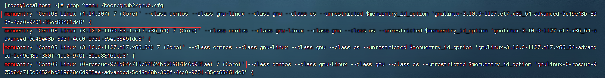

# centos 源代码编译安装内核

查看内核版本

```
cat /proc/version
uname -rs
```

安装依赖包

```
yum install -y gcc gcc-c++ make ncurss-devel openssl-devel elfutils-libelf-devel
```

去官网下载 内核

https://www.kernel.org

mainline(主版本)

stable(稳定版)

longterm(长期支持版)

```
tar xvf linux-*.tar.xz -C /usr/src/kernels
```

配置内核编译参数 

```
cd /usr/src/kernels/linux-*/
make menuconfig
```

使用当前系统内核配置

```
cp /boot/config-kernlversion.platform /usr/src/kernels/linux-*/.config
make menuconfig   #配置内核参数
```

编译前首先要检查我们系统磁盘（/ 目录）是否充足要大于10G以上才可以！！！

编译、安装内核

```
make -j2 all  #-j 指定 cpu数
make modules_install #安装内核模块
make install  #安装内核
```

修改grub 启动内核

```
grub2-deitenv list #获取当前系统内核引导版本
grep ^menu /boot/grub2/grub.cfg #grep 查出来的第一个 是 0 第二个是 1 依次类推
 grub2-set-default 0
 
[root@localhost ~]# grub2-editenv list
saved_entry=0
```




# rpm包升级内核

下载rpm包：https://elrepo.org/linux/kernel/

rpm 升级必须下载 主包、 devel 开发包、头文件 headers  必须保证版本一致

选择lt版本（长期支持版本）

下载&&安装

```
wget https://elrepo.org/linux/kernel/el7/x86_64/RPMS/kernel-lt-5.4.262-1.el7.elrepo.x86_64.rpm

wget https://elrepo.org/linux/kernel/el7/x86_64/RPMS/kernel-lt-devel-5.4.262-1.el7.elrepo.x86_64.rpm

wget https://elrepo.org/linux/kernel/el7/x86_64/RPMS/kernel-lt-headers-5.4.262-1.el7.elrepo.x86_64.rpm

yum -y install ./*.rpm  #安装
```

设置系统默认内核

```
awk -F\' '$1=="menuentry " {print i++ " : " $2}' /etc/grub2.cfg  #查看系统上的所有可用内核

#设置默认内核为我们刚才升级的内核版本
cp /etc/default/grub /etc/default/grub-bak #备份
grub2-set-default 0 #设置默认内核版本

vim /etc/default/grub #编辑grub文件 将GRUB_DEFAULT=saved更改为0
GRUB_DEFAULT=0

grub2-mkconfig -o /boot/grub2/grub.cfg #重新创建内核配置

#查看默认内核
grubby --default-kernel
grub2-editenv list

#重启
reboot 
```

# yum 安装升级内核

1、**配置elrepo源** 

```
rpm --import https://www.elrepo.org/RPM-GPG-KEY-elrepo.org
yum install -y https://www.elrepo.org/elrepo-release-7.el7.elrepo.noarch.rpm
```

2、查看内核版本（选择lt长期支持版）

```
yum list available --disablerepo=* --enablerepo=elrepo-kernel  #查看内核版本

yum -y install --enablerepo=elrepo-kernel kernel-lt-5.4.265-1.el7.elrepo #安装指定版本
```

3、配置从新内核启动

```
grep ^menu /boot/grub2/grub.cfg #grep 查出来的第一个 是 0 第二个是 1 依次类推
 grub2-set-default 0
 
grub2-editenv list
saved_entry=0

reboot #重启系统
```

