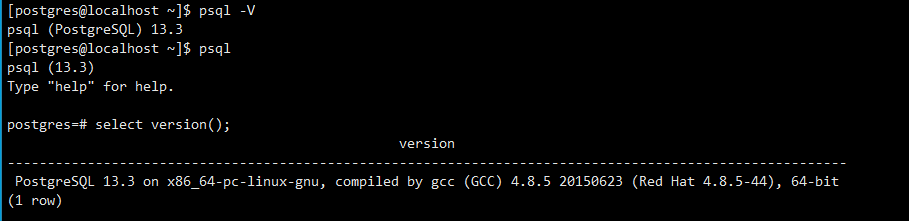
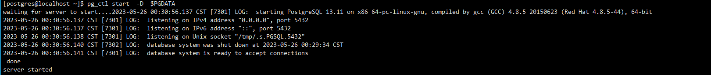
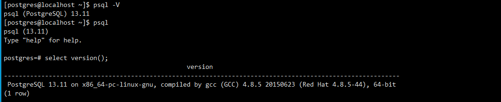

# postgresql 数据库小版本升级

| 旧版本          | 新版本           |
| --------------- | ---------------- |
| postgresql-13.3 | postgresql-13.11 |

升级思路：小版本升级不会改变内部的存储格式，因此总是和大版本兼容。例如，PostgreSQL 12.4 和 PostgreSQL 12.0 以及后续的 PostgreSQL 12.x 兼容。**对于这些兼容版本的升级非常简单，只需要关闭数据库服务，安装替换二进制的可执行文件，重新启动服务即可。**

升级步骤：

现版本



1、上传新版pg包，解压缩备份旧pg的bin、lib、share、include目录

```shell
 tar -zxvf postgresql-13.11.tar.gz  -C /opt/
 cd /opt/postgres/ 
 mkdir /opt/pg13.3bak
 cp  -r /opt/postgres/bin /opt/pg13.3bak
 cp  -r /opt/postgres/lib /opt/pg13.3bak
 cp  -r /opt/postgres/share /opt/pg13.3bak
 cp  -r /opt/postgres/include /opt/pg13.3bak
```

2、停止postgresql 数据库，并编译安装新版本pgsql

```shell
pg_ctl stop -D  $PGDATA
cd /opt/postgresql-13.11
./configure  --prefix=/opt/postgres
 make && make install
 echo $? #如果是0 则以上命令没问题，如果非零则未编译安装成功
 cd contrib/pg_stat_statements/
 make && make install 
```

3、启动数据库，查询数据版本和数据

```
pg_ctl start -D  $PGDATA
```





4、回退：假如 升级过程中遇到故障无法处理进行回退

```
cp -r /opt/pg13.3bak/*  /opt/postgres  #只需要将备份的二进制文件和依赖库文件还原回去即可
```

