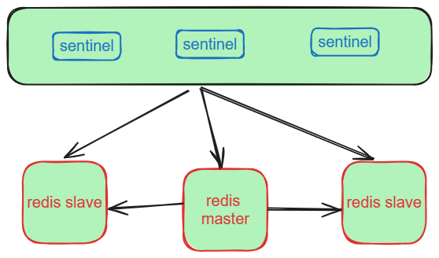

# redis 主从复制、哨兵原理实践解析

## redis单节点架构容易造成：

- reids发生宕机，导致单点故障
- 磁盘故障，造成数据丢失

## 主从复制的特点：

- 主节点可读可写，从节点只读不允许写

- 主节点可以有多个从节点，从节点只能有一个主节点

- 数据流是从主节点到从节点单向的

## 主从部署

|      IP       |                 操作系统                 |    服务器配置     |
| :-----------: | :--------------------------------------: | :---------------: |
| 192.168.0.110 | ubuntu-20.04.5-LTS（redis-6.12.4）master | 内存：4G CPU：1核 |
| 192.168.0.107 |      rocky9.2（reids-6.12.4）slave       | 内存：4G CPU：1核 |

**主从复制，从 5.0.0 版本开始，Redis 正式将 SLAVEOF 命令改名成了 REPLICAOF 命令并逐渐废弃原来的 SLAVEOF 命令**

- 确保保持版本一致

- 确保保持内存一致，（如果无法保证，从节点可以大于主节点，但是主节点不能大于从节点）

master（只是其中重要的部分）

```
#redis.conf
#开启RBD快照
save 3600 1
save 300 100
save 60 10000

bind 0.0.0.0
dbfilename  master.rdb #RDB 快照文件的名称

requirepass 123456  #配置密码  
repl-backlog-size 1mb  #设置复制缓冲区大小。backlog是一个缓冲区，这是一个环形复制缓冲区，用来保存最新复制的命令。当副本断开连接一段时间时，它会累积副本数据，因此当副本想要再次连接时，通常不需要完全重新同步，但部分重新同步就足够了，只需传递副本在断开连接时丢失的部分数据。复制缓冲区越大，复制副本能够承受断开连接的时间就越长，以后能够执行部分重新同步。只有在至少连接了一个复制副本的情况下，才会分配缓冲区，没有复制副本的一段时间，内存会被释放出来，默认1mb 
repl-backlog-ttl 60 #环形缓冲复制队列存活时长

repl-diskless-sync no #是否使用无盘同步，默认为no，no为不使用无盘，需要将RDB文件保存到磁盘后再发送给slave，yes 为支持无盘，RDB 不保存至本地磁盘，而且直接通过socket文件发送给slave
repl-diskless-sync-delay 5 #diskless时复制的服务器等待的延迟时间

repl-ping-replica-period 10 #slave端向master端发送ping的时间间隔
repl-timeout 60 #主从ping连接超时时间 

min-replicas-to-write 3 #设置一个master可用的slave不能少于多少个，否则master无法执行
min-replicas-max-lag 10 #设置至少有上面数量的slave延迟时间大于多少时，master不接受写操作（拒接写入）

repl-disable-tcp-nodelay no #TCP 的 TCP_NODELAY 属性，决定数据的发送时机。配置关闭：主节点产生的数据无论大小都会及时的发送给从节点。redis默认关闭此配置，以保障较小的主从延迟。当然，这需要主从间保持较好的网络状况。
配置打开：主节点会合并较小的TCP数据包以节省宽带，默认发送时间间隔由linux内核设置决定，默认一般40ms。虽然这样大大增加了主从之间的延迟，但是对于网络状况达不到条件或者对主从延迟不敏感的情况比较适用。
```

slave（只是其中重要的部分）

```
#redis.conf
replicaof <masterip> <masterport> #连接那个主库 和主库端口
masterauth <masterpassword>  # 主库密码
save 3600 1
save 300 100
save 60 10000

dbfilename slave.rdb
```


## 全量同步（第一次同步）


1、从库向主库发送psync命令，表示要进行数据同步，主库根据这个命令的参数 来启动复制。psync 命令包含了主库的 runID 和复制进度 offset 两个参数。 

- runID，是每个 Redis 实例启动时都会自动生成的一个随机 ID，用来唯一标记这个实例。当从库和主库第一次复制时，因为不知道主库的 runID，所以将 runID 设 为“？”。
- offset，此时设为 -1，表示第一次复制。

2、主库收到 psync 命令后，会用 FULLRESYNC 响应命令带上两个参数：主库 runID 和主库 目前的复制进度 offset，返回给从库。

3、从库收到响应后，会记录下这两个参数。

**FULLRESYNC 响应表示第一次复制采用的全量复制，也就是说， 主库会把当前所有的数据都复制给从库。**

4、主库执行 bgsave 命令，生成 RDB 文件

5、将RDB快照发给从库

6、从库清空当前数据库数据，在主库将数据同步给从库的过程中，主库不会被阻塞，仍然可以正常接收请求。但是，这些请求中的写操作并没有记录到刚刚生成的 RDB 文件 中。为了保证主从库的数据一致性，主库会在内存中用专门的 replication buffer，记录 RDB 文件生成后收到的所有写操作。


```
782:M 16 Jan 2024 22:09:33.794 * Replica 192.168.0.107:6379 asks for synchronization
782:M 16 Jan 2024 22:09:33.794 * Partial resynchronization not accepted: Replication ID mismatch (Replica asked for 'c793a2942cd3c00f55234d78c787f984960cecf2', my replication IDs are 'f0998e7efeaaaa3c4d9103099ce2ef89ea9b3d9e' and '0000000000000000000000000000000000000000')
782:M 16 Jan 2024 22:09:33.795 * Replication backlog created, my new replication IDs are 'd5f154f3c3da1e57e1f5001baf08177f5471a8d2' and '0000000000000000000000000000000000000000'
782:M 16 Jan 2024 22:09:33.795 * Starting BGSAVE for SYNC with target: disk
782:M 16 Jan 2024 22:09:33.795 * Background saving started by pid 2444
2444:C 16 Jan 2024 22:09:33.797 * DB saved on disk
2444:C 16 Jan 2024 22:09:33.797 * RDB: 0 MB of memory used by copy-on-write
782:M 16 Jan 2024 22:09:33.884 * Background saving terminated with success
782:M 16 Jan 2024 22:09:33.884 * Synchronization with replica 192.168.0.107:6379 succeeded

```


## 增量同步

从 Redis 2.8 开始，网络断了之后，主从库会采用增量复制的方式继续同步。全量复制是同步所有数据，而增量复制只会把主从库网 络断连期间主库收到的命令，同步给从库。


1、从节点连接关闭后，主节点会把写操作记录在收到的写操作命令，写入 replication buffer，同时也 会把这些操作命令也写入 repl_backlog_buffer 这个缓冲区。

2、连接恢复后从库首先会给主库发送 psync 命令，并把自己当前的 slave_repl_offset 发给主库，主库会判断自己的 master_repl_offset 和 slave_repl_offset 之间的差距。然后把 master_repl_offset 和 slave_repl_offset 之间的命令操作同步给从库就行。


repl_backlog_buffer 是一个环形缓冲区，所以在 缓冲区写满后，主库会继续写入，此时，就会覆盖掉之前写入的操作。如果从库的读取速 度比较慢，就有可能导致从库还未读取的操作被主库新写的操作覆盖了，这会导致主从库 间的数据不一致。


repl-backlog-size：允许从节点最大失联多长时间*主节点offset每秒写入量


```
782:M 16 Jan 2024 22:10:47.641 # Connection with replica 192.168.0.107:6379 lost.
782:M 16 Jan 2024 22:11:01.040 * Replica 192.168.0.107:6379 asks for synchronization
782:M 16 Jan 2024 22:11:01.040 * Partial resynchronization request from 192.168.0.107:6379 accepted. Sending 165 bytes of backlog starting from offset 1.
```


查看主从复制

```
INFO replication
```

```
role:master  #指示 Redis 服务器当前的角色（role）master"（主节点）或 "slave"（从节点）。
connected_slaves:1 #表示当前连接的从节点数量
slave0:ip=192.168.0.107,port=6379,state=online,offset=823,lag=1 
master_failover_state:no-failover 
master_replid:d5f154f3c3da1e57e1f5001baf08177f5471a8d2 #主节点的复制 ID（replication ID）。
master_replid2:0000000000000000000000000000000000000000 #主节点的复制 ID（replication ID）的辅助 ID。
master_repl_offset:823 #主节点的复制偏移量（replication offset）。
second_repl_offset:-1 #从节点的复制偏移量（replication offset）。
repl_backlog_active:1  #表示复制 backlog 是否处于活跃状态。如果值为 "0"，表示复制 backlog 未激活；如果值为 "1"，表示复制 backlog 已激活。
repl_backlog_size:1048576 #复制 backlog 的大小（以字节为单位）。
repl_backlog_first_byte_offset:1 #复制 backlog 的第一个字节的偏移量。
repl_backlog_histlen:823 #复制 backlog 当前的历史长度（以字节为单位）

```

为什么使用RDB 来进行主从同步，而不是AOF日志

- 因为AOF文件比RDB文件大，网络传输比较耗时
- 从库在初始化数据时，RDB文件比AOF文件执行更快

# redis  哨兵（Sentinel）

在上面的主从复制中，如果主节点挂了，在想要恢复的话，需要人工手动恢复，非常麻烦，哨兵的出现解决了这种麻烦的人工操作

- 故障检测和自动故障转移
- 配置文件更新和故障节点恢复后的主从同步
- 新主节点选举

哨兵节点主要负责三件事情：**监控、选主、通知**。

架构图




**主观下线**

主观下线适用于所有 主节点 和 从节点。如果在 （配置参数`down-after-milliseconds` 毫秒内），`Sentinel` 没有收到 目标节点 的有效回复，则会判定 该节点 为 **主观下线**。

**客观下线**

客观下线只适用于主节点。哨兵节点之间通过相互通信和协调来判断 Redis 实例的健康状态。当一个哨兵节点主观地认为某个 Redis 实例下线时，它会向其他哨兵节点发送通知，并询问它们对该实例的状态如何。

其他哨兵节点会根据自身的监测结果和配置规则，对该实例进行独立的检查和判断。如果多个哨兵节点在一定的时间间隔内都主观地认为该实例下线，就会达成共识，形成客观下线的状态。

## 哨兵部署

|      IP       |                 操作系统                 |    服务器配置     |
| :-----------: | :--------------------------------------: | :---------------: |
| 192.168.0.110 | ubuntu-20.04.5-LTS（redis-6.12.4）master | 内存：4G CPU：1核 |
| 192.168.0.107 |      rocky9.2（reids-6.12.4）slave1      | 内存：4G CPU：1核 |
| 192.168.0.105 |      rocky9.2（reids-6.12.4）slave2      | 内存：4G CPU：1核 |

配置主从

master（只是其中重要的部分）

```
bind 0.0.0.0
#开启RBD快照
save 3600 1
save 300 100
save 60 10000
#RDB 快照文件的名称
dbfilename master.rdb
requirepass 123456
masterauth 123456 #主节点也要开启，如果主节点挂了，需要和新主同步
```

slave1（只是其中重要的部分）

```
bind 0.0.0.0
replicaof 192.168.0.110 6379
masterauth 123456
requirepass 123456
#开启RBD快照
save 3600 1
save 300 100
save 60 10000
#RDB 快照文件的名称
dbfilename slave1.rdb
```

slave2（只是其中重要的部分）

```
bind 0.0.0.0
replicaof 192.168.0.110 6379
masterauth 123456
requirepass 123456
#开启RBD快照
save 3600 1
save 300 100
save 60 10000
#RDB 快照文件的名称
dbfilename slave2.rdb
```

配置好后启动reids ，通过redis-cli 查看主从

```
# Replication
role:master
connected_slaves:2
slave0:ip=192.168.0.107,port=6379,state=online,offset=2240,lag=1
slave1:ip=192.168.0.105,port=6379,state=online,offset=2240,lag=1
master_failover_state:no-failover
master_replid:cd181715fce675343a1749a995c8e86ce8d45923
master_replid2:0000000000000000000000000000000000000000
master_repl_offset:2240
second_repl_offset:-1
repl_backlog_active:1
repl_backlog_size:1048576
repl_backlog_first_byte_offset:1
repl_backlog_histlen:2240

```

配置哨兵

sentinel官方配置文档：https://redis.io/docs/management/sentinel/

master

sentinel.conf（这个文件一般在编译完成后reids目录就有，只需要copy更改就可以了只是其中重要的部分）

```
#sentinel.conf

bind 0.0.0.0 #允许所有ip访问

port 26379 # 监听端口

daemonize yes # 守护进程的形式运行

pidfile /var/run/redis-sentinel.pid # 进程PID

logfile "/opt/redis/logs/sentinel.log" # 日志文件

dir /opt/redis/data/ # 工作目录

sentinel monitor mymaster 192.168.0.110 6379 2 # 这里定义主库的IP和端口，还有最后的2表示要达到2台sentinel认同才认为主库已经挂掉 mymaster 集群名称可更改但3个sentinel 要相同

sentinel down-after-milliseconds mymaster 30000 # 主库在30000毫秒（即30秒）内没有反应就认为主库挂掉（即主观失效）

sentinel auth-pass mymaster 123456 #要和上面的集群名称一致，配置redis 主从复制的密码，

acllog-max-len 128

sentinel parallel-syncs mymaster 1 #故障转移后，可以向新master同步数据的slave数量，数字越小总同步时间越长，但可以减轻新master的负载压力
sentinel failover-timeout mymaster 180000 #所有slaves指向新的master所需的超时时间，默认 180秒 ，默认单位是毫秒
sentinel deny-scripts-reconfig yes #禁止修改脚本
```

slave1

```
#sentinel.conf

bind 0.0.0.0 #允许所有ip访问

port 26379 # 监听端口

daemonize yes # 守护进程的形式运行

pidfile /var/run/redis-sentinel.pid # 进程PID

logfile "/opt/redis/logs/sentinel.log" # 日志文件

dir /opt/redis/data/ # 工作目录

sentinel monitor mymaster 192.168.0.110 6379 2 # 这里定义主库的IP和端口，还有最后的2表示要达到2台sentinel认同才认为主库已经挂掉 mymaster 集群名称可更改但3个sentinel 要相同

sentinel down-after-milliseconds mymaster 30000 # 主库在30000毫秒（即30秒）内没有反应就认为主库挂掉（即主观失效）

sentinel auth-pass mymaster 123456 #要和上面的集群名称一致，配置redis 主从复制的密码，

acllog-max-len 128

sentinel parallel-syncs mymaster 1 #故障转移后，可以向新master同步数据的slave数量，数字越小总同步时间越长，但可以减轻新master的负载压力
sentinel failover-timeout mymaster 180000 #所有slaves指向新的master所需的超时时间，默认 180秒 ，默认单位是毫秒
sentinel deny-scripts-reconfig yes #禁止修改脚本
```

slave2

```
#sentinel.conf

bind 0.0.0.0 #允许所有ip访问

port 26379 # 监听端口

daemonize yes # 守护进程的形式运行

pidfile /var/run/redis-sentinel.pid # 进程PID

logfile "/opt/redis/logs/sentinel.log" # 日志文件

dir /opt/redis/data/ # 工作目录

sentinel monitor mymaster 192.168.0.110 6379 2 # 这里定义主库的IP和端口，还有最后的2表示要达到2台sentinel认同才认为主库已经挂掉 mymaster 集群名称可更改但3个sentinel 要相同

sentinel down-after-milliseconds mymaster 30000 # 主库在30000毫秒（即30秒）内没有反应就认为主库挂掉（即主观失效）

sentinel auth-pass mymaster 123456 #要和上面的集群名称一致，配置redis 主从复制的密码，

acllog-max-len 128

sentinel parallel-syncs mymaster 1 #故障转移后，可以向新master同步数据的slave数量，数字越小总同步时间越长，但可以减轻新master的负载压力
sentinel failover-timeout mymaster 180000 #所有slaves指向新的master所需的超时时间，默认 180秒 ，默认单位是毫秒
sentinel deny-scripts-reconfig yes #禁止修改脚本
```

启动

```
./bin/redis-sentinel ./etc/sentinel.conf &
```

启动之后每个sentinel.conf都会在末尾有

```
protected-mode no
user default on nopass sanitize-payload ~* &* +@all
sentinel myid 999f9fadc5e669d250f21784c6c47d385bf4c572 #每个sentinel的id必须不同
sentinel config-epoch mymaster 0
sentinel leader-epoch mymaster 0
sentinel current-epoch 0
sentinel known-replica mymaster 192.168.0.105 6379
sentinel known-replica mymaster 192.168.0.107 6379
sentinel known-sentinel mymaster 192.168.0.105 26379 49d99518a6fbff21485287bec34e181aa60cbc5f
sentinel known-sentinel mymaster 192.168.0.107 26379 d90d1e650755fa7d4f9face391614a2f20955cad
```

查看哨兵

```
127.0.0.1:26379> info sentinel #查看哨兵
# Sentinel
sentinel_masters:1
sentinel_tilt:0
sentinel_running_scripts:0
sentinel_scripts_queue_length:0
sentinel_simulate_failure_flags:0
master0:name=mymaster,status=ok,address=192.168.0.110:6379,slaves=2,sentinels=3
```

## 哨兵是如何选新主的

哨兵选择新主过程可以分为两步 **筛选+打分**，在多个从库 中，先按照一定的筛选条件，把不符合条件的从库去掉。然后，我们再按照一定的规则， 给剩下的从库逐个打分，将得分最高的从库选为新主库

筛选的条件主要是：

1. 检测该从库是否在线
2. 判断从库之前的网络连接状态

从库打分过程

第一轮：优先级最高的从库得分高。

手动配置优先级

```
#redis.conf
replica-priority 100 #值越小，优先级越高，优先成为新主
```

第二轮：和旧主库同步程度最接近的从库得分高。

查看每个从库 的 slave_repl_offset这个值，和旧主的 master_repl_offset最接近，如果越接近，分数越高

第三轮：ID 号小的从库得分高。

每个实例都会有一个 ID，这个 ID 就类似于这里的从库的编号。目前，Redis 在选主库 时，有一个默认的规定：在优先级和复制进度都相同的情况下，ID 号最小的从库得分最 高，会被选为新主库。

## 客户端连接

客户端连接的是sentinel地址

java：https://github.com/oyhk/redis-sentinel-java

go：https://redis.uptrace.dev/zh/guide/go-redis-sentinel.html

python： https://github.com/alisaifee/coredis
